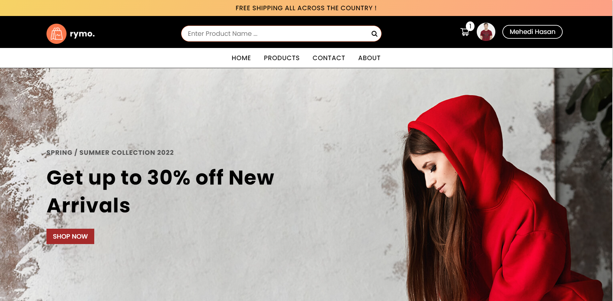
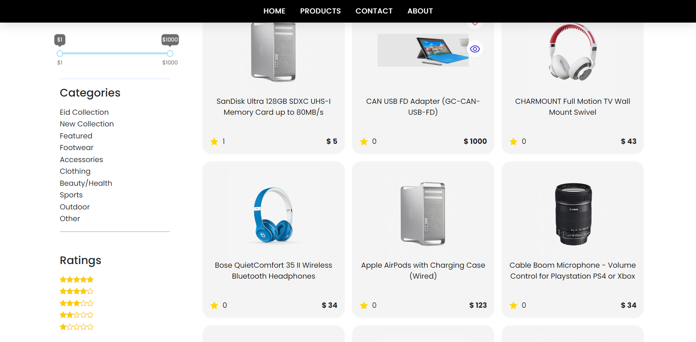
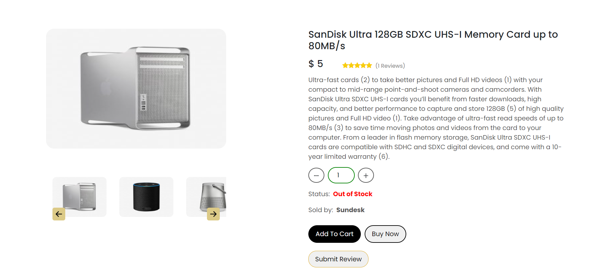
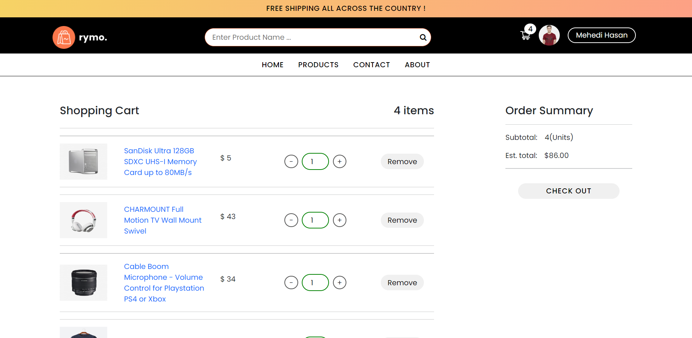
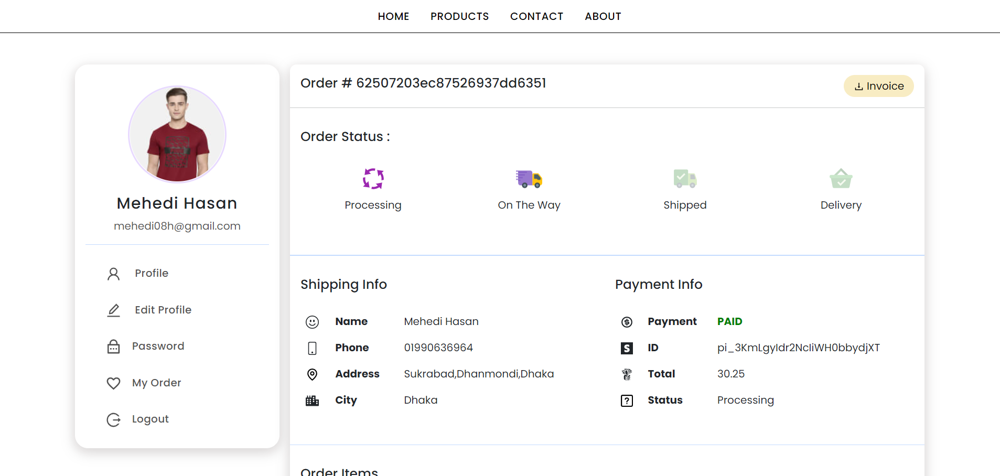

# MERN Stack Full E-commerce Site

A powerful full-stack e-commerce application built with the MERN stack (MongoDB, Express.js, React, and Node.js). This project includes authentication, payment integration, an admin dashboard, and more.

## 🛠 Technologies Used

- **Frontend:** React, Redux Toolkit, Tailwind CSS
- **Backend:** Node.js, Express.js, MongoDB
- **State Management:** Redux
- **Authentication:** JSON Web Tokens (JWT), Cookies
- **File Storage:** Cloudinary
- **Payment Integration:** Stripe
- **Database:** MongoDB with Mongoose
- **Other Features:** Pagination, Filtering, Search, Reviews & Ratings

## 🔥 Features

✅ Fully functional e-commerce platform  
✅ Authentication & Authorization (JWT & Cookies)  
✅ Admin Dashboard (Manage products, orders, reviews, and users)  
✅ Secure payment processing with Stripe  
✅ Image management with Cloudinary  
✅ Advanced search, filters, and pagination  
✅ Ratings & Reviews system  
✅ Shopping cart & checkout process  

[Live Site](https://shopx-mern-app.herokuapp.com/)

## Homepage

## Product Page

## Product Details Page

## Cart Page

## Order Details

